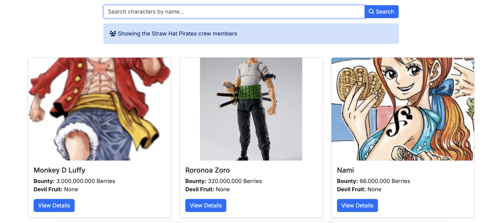
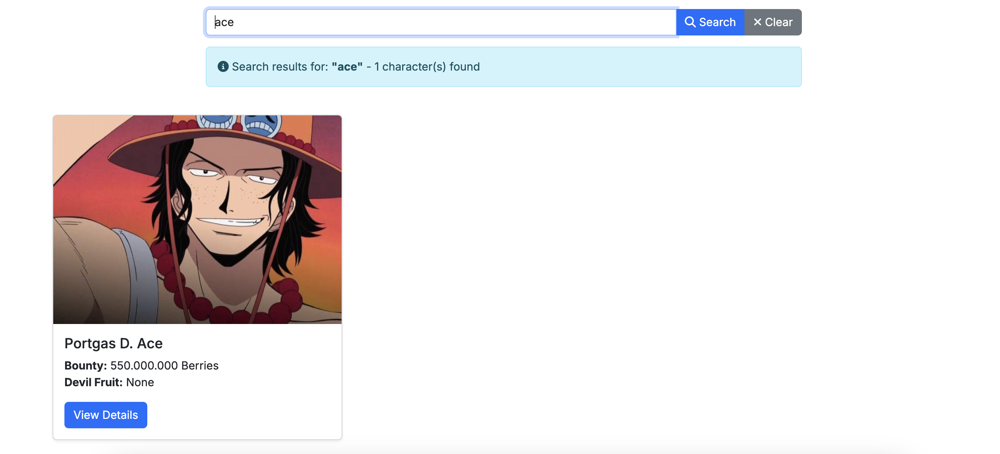
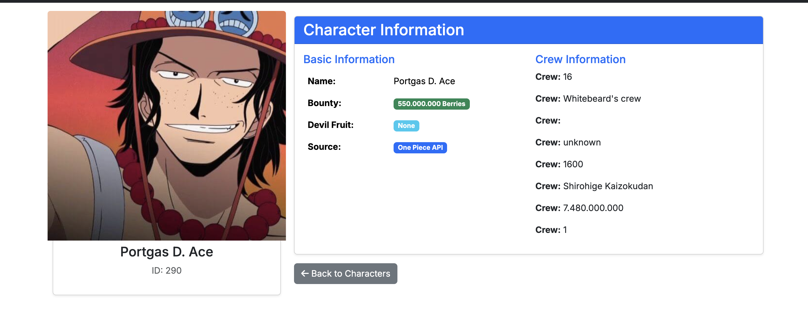

# 🏴‍☠️ One Piece Character Catalog

A fun side project I built while learning Laravel! As a seasoned developer exploring new frameworks, I wanted to create something both useful and entertaining - what better than a catalog of my favorite anime characters?

## What's This About?

This is a Laravel web application that displays One Piece characters with their details, images, and search functionality. Think of it as a digital encyclopedia for the Straw Hat Pirates and their world!

## ✨ Features

-   **🏴‍☠️ Straw Hat Crew**: Display the entire crew by default (because they're the best!)
-   **🔍 Character Search**: Search for any One Piece character by name
-   **📖 Character Details**: View detailed information about each character (bounty, devil fruit, crew, etc.)
-   **��️ Dynamic Images**: Automatically fetch character images from Google Custom Search
-   **⚡ API Integration**: Uses the One Piece API for character data
-   **💾 Smart Caching**: Implements caching for improved performance and rate limit management
-   **📱 Responsive Design**: Works great on desktop and mobile

## 🛠️ Tech Stack

-   **Laravel 11**: PHP framework (learning this was the main goal!)
-   **Bootstrap 5**: Frontend styling
-   **One Piece API**: External API for character data
-   **Google Custom Search API**: For character images
-   **SQLite**: Database (for Laravel's internal needs)

## �� Quick Setup

1. **Clone the repo**

    ```bash
    git clone git@github.com:thenewguy25/onepieiece-catalog.git
    cd onepieiece-catalog
    ```

2. **Install dependencies**

    ```bash
    composer install
    ```

3. **Set up environment**

    ```bash
    cp .env.example .env
    php artisan key:generate
    ```

4. **Configure API keys** (add to `.env`)

    ```env
    GOOGLE_API_KEY=your_google_api_key_here
    GOOGLE_SEARCH_ENGINE_ID=your_search_engine_id_here
    ```

5. **Run migrations**

    ```bash
    php artisan migrate
    ```

6. **Start the server**

    ```bash
    php artisan serve
    ```

7. **Visit** `http://localhost:8000` and enjoy! 🎉

## 🔑 API Keys Required

You'll need:

-   **Google Custom Search API key** - for character images
-   **Google Custom Search Engine ID** - to configure the search

Get them from the [Google Cloud Console](https://console.cloud.google.com/).

## �� What I Learned

As someone coming from other frameworks (like CakePHP), this project helped me understand:

-   Laravel's service layer architecture
-   Route naming and resource controllers
-   Caching strategies
-   External API integration
-   Blade templating
-   Laravel's HTTP client

## 🤔 Why One Piece?

Because it's awesome! But also because it has a rich character database that's perfect for learning API integration and data display patterns.

## �� Screenshots

### Home Page - Straw Hat Crew


_The main page displaying all Straw Hat crew members by default_

### Character Search Results


_Searching for characters returns detailed information with images_

### Character Detail Page


\*Detailed view showing character information, bounty, devil

## 🐛 Known Issues

-   Some character images might not load due to CORS restrictions (especially wikia/fandom links)
-   Google API has rate limits (but we cache everything, so it's not too bad!)

## 🚧 Future Improvements

-   [ ] Add character relationships (crew members, allies, enemies)
-   [ ] Implement character filtering by crew/affiliation
-   [ ] Add character battle stats
-   [ ] Create character comparison feature
-   [ ] Add more detailed character backstories

## 📝 License

MIT License - feel free to use this for your own learning projects!

---

_Built with ❤️ and lots of ☕ while learning Laravel_
